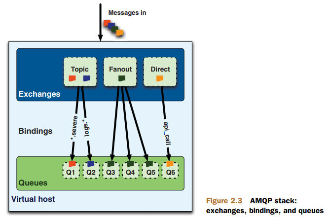
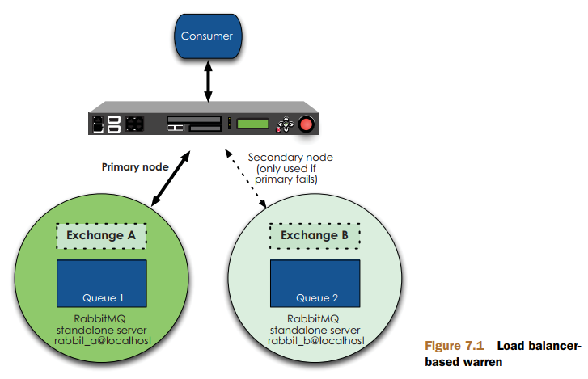
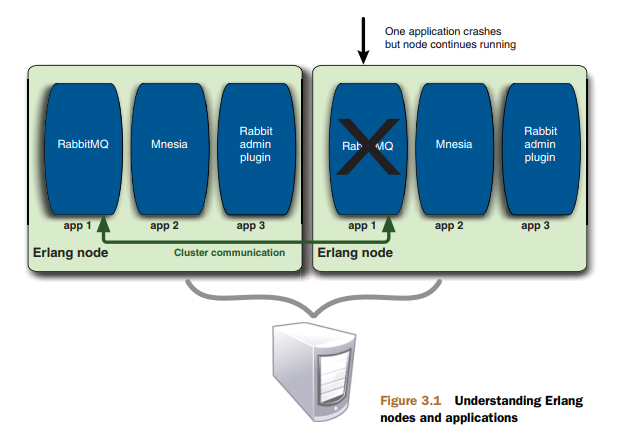

# RabbitMQ in Action

读书笔记

## 四种类型的交换器 exchange

[direct](img/Figure-2.4-direct-exchange-message-flow.png)、[fanout](img/Figure-2.4-fanout-exchange-message-flow.png)、[topic](img/Figure-2.4-topic-exchange-message-flow.png) 和 headers。

其中 headers 交换器允许你匹配 AMQP 消息的 header 而非路由键，它和 direct 交换器完全一样，但性能会差很多，因此它并不太实用。



- [2.2 从底部开始构造：队列](https://www.amazon.cn/dp/B016WSA4OA)
- [2.3 联合起来：交换器和绑定](https://www.amazon.cn/dp/B016WSA4OA)

## 消息持久化 durable 

为了实现 RabbitMQ 重启后消息不丢失，exchange、queue 和 message 本身都需要分别设置成持久化。

## 消息确认 ack

从队列取出消息时，可开启自动确认 ack，那么消息在取出后会立即确认。或者当消费完毕后再进行确认。在多数情况下，后者会更加可靠，因为它避免了 worker 应意外退出而未能再次重试的情况。

## 公平派发 Fair dispatch

为了让消息平均分配到每一个 worker，充分利用 worker 资源，减少出现有些 worker 很忙有些没事可做的情况，可将队列的订阅规则调整为每次只获取一条消息。

```php
$channel->basic_qos(null, 1, null);
```

那么每个 worker 都只会在处理完当前的消息后，才会获取下一条消息。 

- [Work Queues](https://www.rabbitmq.com/tutorials/tutorial-two-php.html)

## 集群

RabbitMQ 内建集群的两个目标：

1. 允许消息者和生产者在 RabbitMQ 节点崩溃的情况下继续运行；（这一点并不完全适用于持久化的队列）
2. 通过添加更多的节点来线性扩展消息通许的吞吐量；

集群中的节点是一种平行的关系，可以相互加入并随时退出。

```sh
# join cluster
rabbit2$ rabbitmqctl stop_app
rabbit2$ rabbitmqctl join_cluster rabbit@rabbit1
rabbit2$ rabbitmqctl start_app

rabbit3$ rabbitmqctl stop_app
rabbit3$ rabbitmqctl join_cluster --ram rabbit@rabbit2
rabbit3$ rabbitmqctl start_app

# remove from cluster
rabbit3$ rabbitmqctl stop_app
rabbit3$ rabbitmqctl reset
rabbit3$ rabbitmqctl start_app
```

RabbitMQ 节点和 CLI 工具（如：`rabbitmqctl`） 都是通过认证 Erlang cookie 的方式来允许相互通讯。

> On UNIX systems, the cookie will be typically located in `/var/lib/rabbitmq/.erlang.cookie` (used by the server) and `$HOME/.erlang.cookie` (used by CLI tools). 

搭建集群时，需要将某一个节点的 cookie 值复制到其他节点服务器，它们的值必须一致才能进行通讯。

队列和消息内容会存储在集群中的某一个节点，所以只有该节点才拥有该队列的所有信息。
但是，访问集群中任何一个节点，都可以访问到该队列。因为非所有者节点都拥有该队列的元数据和指向该队列所在节点的指针。
因此当集群节点崩溃时，该节点的队列和关联的绑定就都消失了。附加在那些队列上的消费者丢失了其订阅的消息，并且任何匹配该队列绑定信息的新消息也都丢失了。

别担心，你可以让消息者重连到集群并创建队列，对吧？这种做法仅当队列最开始没有被设置成可持久化时是可行的。如果重新创建的队列被标记成持久化了，那么在其他节点上重新声明他们的话会报错。
这样确保了当失败节点恢复后加入集群，该节点上的队列消息不会丢失。想要该指定重回集群的唯一方法是恢复故障节点。但是如果消息者尝试重建的队列不是可持久化的，那么重新声明就可以了。

为什么默认情况下 RabbitMQ 不将队列内容和状态复制到所有节点上？

- 存储空间 —— 如果每个集群节点都拥有所有队列的完整拷贝，那么添加新的节点不会给你带来更多的存储空间。
- 性能 —— 消息的发布需要将消息复制到每一个集群节点。对于持久化消息来说，每一条消息都会触发磁盘活动。每次新增节点，网络和磁盘负载都会增加，最终只能保持集群性能的平稳（甚至更糟）。

通过设置集群中的唯一节点来负责任何特定队列，只有该负责节点才会因队列消息而遭受磁盘活动的影响。所有其他节点需要将接收到的该队列的消息传递给该队列的所有者节点。
因此，Rabbit 集群添加更多的节点意味着你将拥有更多的节点来传播队列，这些新增节点为你带来了性能的提升。
当负载增加时，RabbitMQ 集群是性能扩展的最佳方案。

- [5.2 集群架构](https://www.amazon.cn/dp/B016WSA4OA)
- [Clustering Guide](https://www.rabbitmq.com/clustering.html)

## 磁盘节点和内存节点

内存节点（RAM node）将所有元数据都仅存储在内存中，而磁盘节点则将元数据存储在磁盘中。元数据包括队列、交换器、绑定、用户、权限和 vhost 的定义。

注意：内存节点的持久化队列和消息内容依然会存储在硬盘上。

为什么要将元数据仅存在内存中？因为它使得像队列和交换器声明之类的操作更加快速。

RabbitMQ 只要求在集群中至少有一个磁盘节点，所有其他节点都可以是内存节点。记住，当节点加入或离开集群时，他们必须要将变更通知到至少一个磁盘节点。
如果只有一个磁盘节点，而且不凑巧的是它刚好又崩溃了，那么集群可以继续路由消息，但是不能做以下的操作了：

- 创建队列
- 创建交换器
- 创建绑定
- 添加用户
- 更改权限
- 添加或删除集群节点

换句话说，如果集群中唯一的磁盘节点崩溃的话，集群仍然可以保持运行，但是直到将该节点恢复到集群前，你无法更改任何东西。解决方案是在集群中设置两个磁盘节点，因此他们中至少有一个是可用的，能在任何时候保存元数据变更。
只有一个需要所有磁盘节点必须在线的操作是添加或者删除集群节点。当内存节点重启后，它们会连接到预先配置的磁盘节点，下载当前集群元数据拷贝。
如果你只将两个磁盘节点中的一个告诉该内存节点，而不凑巧的是当内存节点供电中断时该磁盘节点也发生故障的话，那么内存节点在重启之后就无法找到集群了。
所以当添加内存节点时，确保告知其所有的磁盘节点（内存节点唯一存储到磁盘的元数据信息是集群中磁盘节点的地址）。
只要内存节点可以找到至少一个磁盘节点，那么它就能重启后重新加入集群。

- [5.2.3 是内存节点还是磁盘节点](https://www.amazon.cn/dp/B016WSA4OA)

## 镜像队列

像普通队列那样，镜像队列的主拷贝仅存在于一个节点（主队列，master）上，但与普通队列不同的是，镜像节点在集群中的其他节点上拥有队列（slave）拷贝。
一旦队列主节点不可用，最老的从队列将被选择为新的主队列。

> If the node that hosts queue master fails, the oldest mirror will be promoted to the new master as long as it synchronised. Unsynchronised mirrors can be promoted, too, depending on queue mirroring parameters.

- [Highly Available (Mirrored) Queues](https://www.rabbitmq.com/ha.html)

## 负载均衡 

让队列平均分布在集群中的每个节点。

通过使用负载均衡（load balance），不仅可以减少应用程序处理节点故障代码的复杂性，又能确保在集群中连接的平均分布。

使用 [HAProxy](http://www.haproxy.org/) 作为负载均衡器。一台负载均衡器表示了单个 IP 地址背后存在多台服务器。它可以实现负载均衡、故障服务器检测和故障转移。
当有节点发生故障时，连接会丢失，worker 可能会报错退出，此时可配合 [Supervisor](http://www.supervisord.org/) 实现程序的自动重启。

但是，对于高可用以上所做的仍然不够，比如，当节点发生故障时，如何保证持久化队列仍然可用？

- [6.1 为RabbitMQ做负载均衡](https://www.amazon.cn/dp/B016WSA4OA)

## 主/备方式

集群迫使你不得不在以下两者做权衡：所有节点表现得像独立单元来分布负载的优点，但是在故障节点恢复前无法使用持久化队列的缺点。

用我们的话来说，一个 warren 是指一对主 / 备独立服务器，并前置一台负载均衡器来处理故障转移（见下图）。
这样设置的好处是，这是真正的无共享架构。主服务器和备用服务器之间没有协作，所有任何影响到主服务器的问题不会自动转移到备用服务器上，反过来也一样。
它们分离得足够彻底，以至于你可以运行不同版本的 RabbitMQ。

这种方式在当主节点发生故障时，可以马上有一个重新发布和消费消息的地方。同时当主节点恢复时，它允许你的消费者重新连接并消费主节点发生故障时队列上的那些消息。



- [7.1 warren: 另一种集群方式](https://www.amazon.cn/dp/B016WSA4OA)

## 心跳检查 heartbeat

客户端和 RabbitMQ 服务器之间的 TCP 连接，在长时间空闲后可能会被系统杀死。
为了避免这种情况，RabbitMQ 服务器默认启动 60 秒心跳检查。
每 60 秒检查一下该 TCP 连接的客户端是否还在线，如超过检查到两次对方无回应，则会断开该连接。

客户端在连接时，可以动态设置心跳检查时间，如调整为 15 秒检查一次。心跳检查可以是双向的，有些客户端库（如 `php-amqplib`）也支持定期检查 RabbitMQ 服务器的存活情况。

值得注意的是，当引入了 HAProxy 时，由于其默认的客戶端和服务器不活跃的超时时间都是 50 秒，所以应将该时间调整比 60 秒大，或者将 RabbitMQ 心跳检查时间调整为比 50 秒小。 

```
# /etc/haproxy/haproxy.cfg
defaults
    mode    http
    timeout connect 5000
    timeout client  50000
    timeout server  50000
```

- [Detecting Dead TCP Connections with Heartbeats and TCP Keepalives](https://www.rabbitmq.com/heartbeats.html)
- [HAProxy 最佳實踐筆記](http://fangpeishi.com/haproxy_best_practice_notes.html)
- [使用 rabbitmq 中 heartbeat 功能可能会遇到的问题](https://my.oschina.net/moooofly/blog/209823?p=1)
- [rabbitmq——heartbeat](https://my.oschina.net/hncscwc/blog/195343)
- [Does a TCP socket connection have a “keep alive”?](https://stackoverflow.com/questions/1480236/does-a-tcp-socket-connection-have-a-keep-alive)
- [Reliability Guide](https://www.rabbitmq.com/reliability.html)

## AMQP

[Advanced Message Queuing Protocol](https://en.wikipedia.org/wiki/Advanced_Message_Queuing_Protocol)（AMQP，高级消息队列协议），是面向消息中间件的开放标准应用层协议，以解决众多的消息队列需求和拓扑结构问题。
RabbitMQ 使用 Erlang 语言实现了 AMQP 的大部分协议特征。

- [AMQP 0-9-1 Model Explained](https://www.rabbitmq.com/tutorials/amqp-concepts.html)
- [1.1 住在别人的地下城堡](https://www.amazon.cn/dp/B016WSA4OA)
- [AMQP和RabbitMQ入门](http://www.infoq.com/cn/articles/AMQP-RabbitMQ)

## Erlang/RabbitMQ/Mnesia

RabbitMQ 是用 Erlang 语言编写的 AMQP 服务器。

Mnesia 是内建在 Erlang 的非 SQL 型数据库。而 RabbitMQ 使用 Mnesia 存储服务器信息，比如队列、交换器和绑定的元数据、虚拟主机等。

我们经常使用术语节点来指代 RabbitMQ 服务器实例。实际上，节点描述的是一个 Erlang 节点运行着一个 Erlang 应用程序。
同时，如果应用程序由于某些原因（例如 RabbitMQ 崩溃了）崩溃了，Erlang 节点会自动尝试重启应用程序（前提是 Erlang 本身没有崩溃）。
现在重要的是记住当我们谈到 RabbitMQ 节点时，我们指的是 RabbitMQ 应用程序和其所在的 Erlang 节点（见下图）。



- [3.1.1 启动节点](https://www.amazon.cn/dp/B016WSA4OA)


